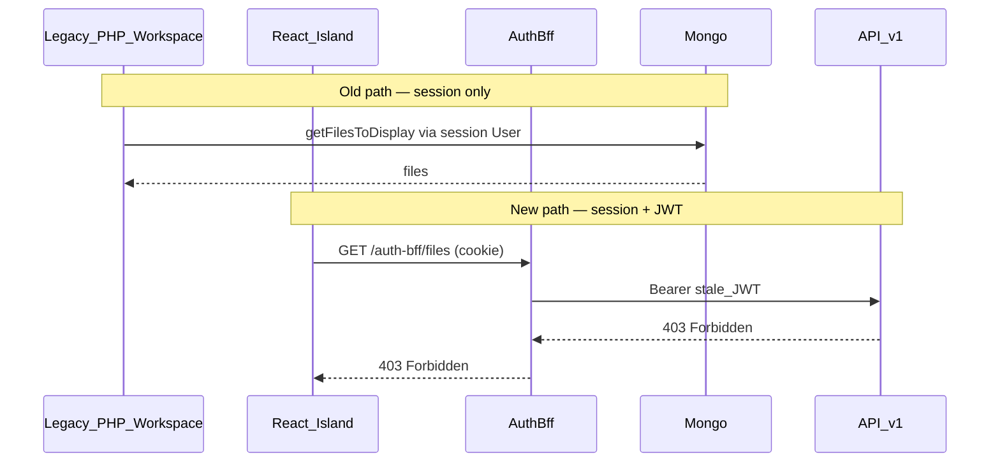
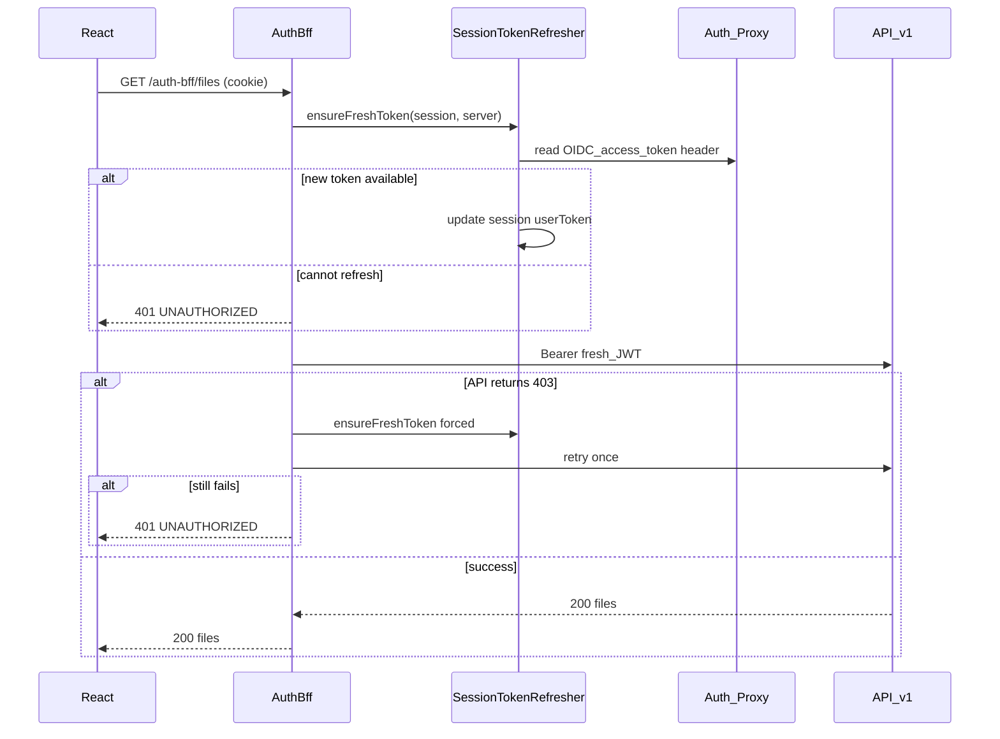
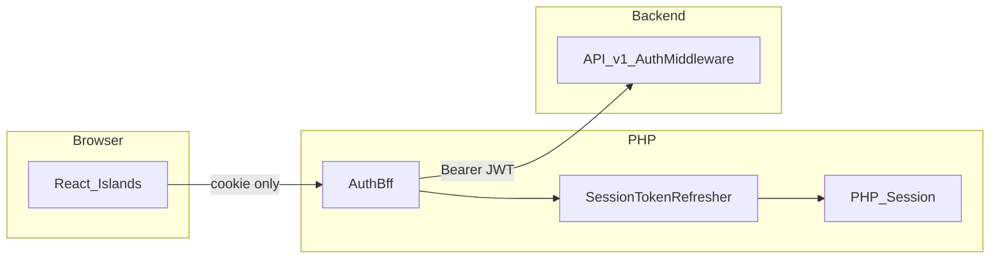

# AuthBff just-in-time token refresh

## Overview

React islands call `/auth-bff/*` with only the PHP session cookie. **AuthBff** is the session and auth boundary for islands: it reads the OIDC access token from the PHP session, refreshes it just-in-time when needed, and proxies requests to `/api/v1` with a `Bearer` JWT. Islands do not manage tokens themselves.

## Why this problem exists

OpenVRE uses **two independent clocks** for authentication:

| Clock | Owner | Typical lifetime | Used by |
|---|---|---|---|
| PHP session cookie | `session.inc` / `checkSession.php` | ~1 hour (`TIMEOUT`) | Legacy PHP pages, AuthBff cookie check |
| OIDC access token (JWT) | Keycloak / auth proxy | ~5–15 min (Keycloak config) | `/api/v1` via `AuthMiddleware` |

- **Legacy workspace** loads files via PHP session → Mongo directly (`getFilesToDisplay()`). It never checks the JWT.
- **React islands** load files via cookie → AuthBff → Bearer JWT → `/api/v1/files`. The API validates the JWT on every request.
- A **valid PHP session** does not guarantee a **valid JWT**. After the JWT expires, islands could receive `403 Forbidden` while the legacy UI still worked.
- `refresh_token()` existed in PHP but uses **browser redirects** (`header('Location: …')` + `exit`) — unsuitable for `fetch()` JSON calls from islands.

### Architecture comparison (before fix)



## Example of the problem

1. User logs in → PHP session (~1 h) and JWT (~10 min) stored in `$_SESSION['userToken']`.
2. User stays on the workspace page for 15 minutes without a full reload.
3. The legacy PHP-rendered table still works; the React island refetches via `getUserFiles()`.
4. Browser console shows:

   ```
   GET http://localhost:8088/auth-bff/files 403 (Forbidden)
   ```

5. A full page reload or re-login fixes it (fresh JWT written to session).

**Before fix — island error response (proxied API 403):**

```json
{
  "code": "FORBIDDEN",
  "status": 403,
  "message": "Invalid token: Expired token"
}
```

**After fix — when refresh cannot recover auth, AuthBff returns 401:**

```json
{
  "code": "UNAUTHORIZED",
  "status": 401,
  "message": "Session expired"
}
```

Islands should treat `401` as “log in again”. No React session wrapper is required.

## The solution (summary)

| Aspect | Detail |
|---|---|
| **Owner** | AuthBff only — no React session wrapper |
| **When** | Proactive refresh if `userToken` is expired; one forced retry if `/api/v1` returns 403 |
| **How** | `SessionTokenRefresher` reads `OIDC_access_token` from the auth proxy, updates the session, then proxies |
| **Failure** | Return `401` JSON from the BFF (do not forward API `403`) |

### Solution flow (after fix)



## Solution detail (for implementers)

### Files

| File | Role |
|---|---|
| `front_end/openVRE/public/auth-bff/SessionTokenRefresher.php` | BFF-safe refresh logic (no redirects) |
| `front_end/openVRE/public/auth-bff/AuthBff.php` | Calls refresher before proxy; 403 retry; normalizes to 401 |
| `front_end/openVRE/public/auth-bff/index.php` | Entry point; passes `$_SESSION` by reference |
| `front_end/openVRE/public/phplib/projects.inc.php` | `refresh_token()` delegates to shared refresher; keeps redirect behaviour for profile page |
| `front_end/openVRE/tests/AuthBff/AuthBffTest.php` | Unit tests for refresh and retry paths |

### `SessionTokenRefresher::ensureFreshToken()`

```php
ensureFreshToken(array &$session, array $server, bool $force = false): bool
```

- **`$force = false`**, token not expired → returns `true` (no OIDC headers needed).
- Token expired (or **`$force = true`**) → reads `OIDC_access_token` and `OIDC_access_token_expires` from `$server`.
- New token available and different from the current one → updates `$session['userToken']`, returns `true`.
- Missing `userToken`, no OIDC header, or OIDC token equals the stale session token → returns `false`.

### `AuthBff::handle()`

1. Validates session and path allowlist (unchanged).
2. Skips refresh for fixture short-circuits (`GET /files` with fixtures, `GET /tools`).
3. Calls `ensureFreshToken()` before the first proxy to `/api/v1`.
4. On downstream `403`, calls `ensureFreshToken(..., force: true)` and retries the proxy **once**.
5. If refresh fails or the retry still returns `403` → `401 UNAUTHORIZED` JSON.

`$_SESSION` is passed **by reference** so refreshed tokens persist for subsequent requests in the same session.

### Relationship to `refresh_token()`

Profile page manual refresh (`applib/refreshToken.php`) still uses `refresh_token()` in `projects.inc.php`. That function now delegates to `SessionTokenRefresher` for the core update logic but **keeps browser redirect** when the OIDC proxy cannot supply a new token (OAuth re-auth flow).

### What islands do

Nothing new. Keep using:

```ts
fetch('/auth-bff/files', { credentials: 'same-origin' })
```

Treat `401` as session/auth dead. No periodic token polling in React.

### Component responsibilities



## Out of scope

| Item | Rationale |
|---|---|
| React `fetch` wrapper / interceptors | AuthBff is the session boundary; islands stay thin HTTP clients |
| Periodic token polling in islands | Refresh is on-demand in AuthBff before each proxy call |
| Replacing `checkSession.php` UX in `main.js` | Legacy PHP session warnings remain separate (~1 h idle) |
| Changing `/api/v1` `AuthMiddleware` | API continues to validate JWT only; refresh is a BFF concern |

## Testing and verification

### PHPUnit

From `front_end/openVRE`:

```bash
composer test -- --filter AuthBffTest
```

Key cases: valid token proxies once; expired token + new OIDC header refreshes; expired + no OIDC → 401; API 403 + successful refresh → retry succeeds; API 403 + failed refresh → 401.

### Manual checks

1. **With OIDC proxy:** log in, wait for JWT expiry (or shorten token TTL in dev), trigger an island refetch — files should load without re-login.
2. **Without OIDC proxy (local dev):** expired JWT → `401` from AuthBff (expected).
